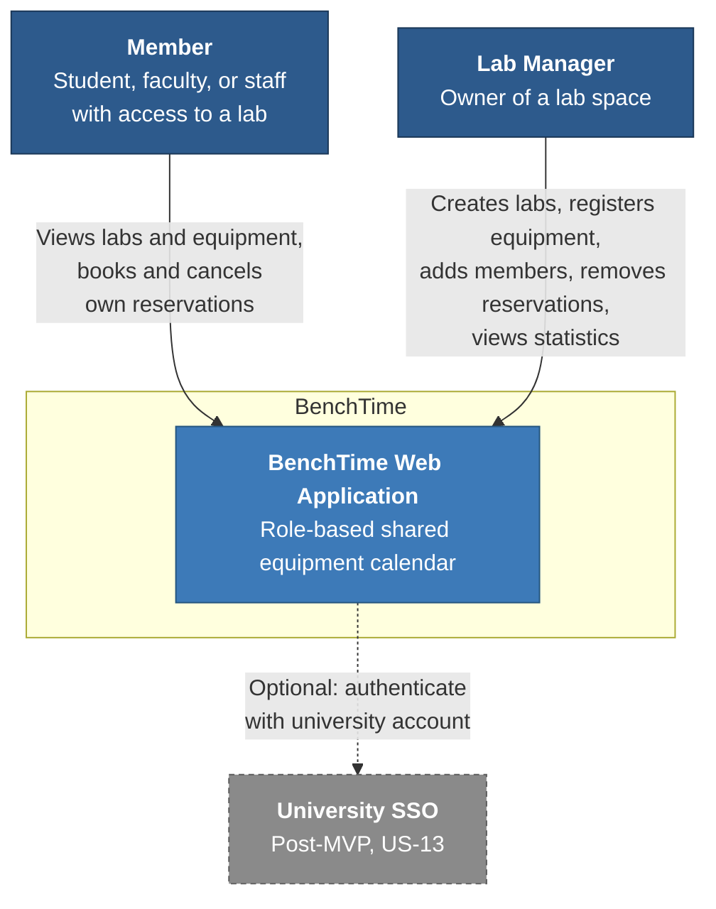
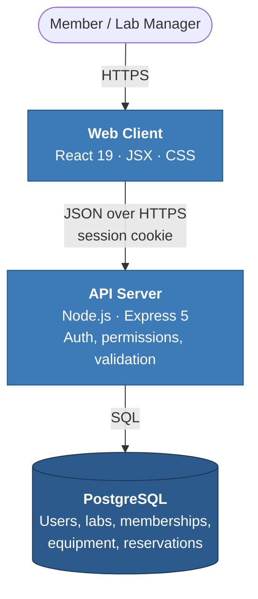
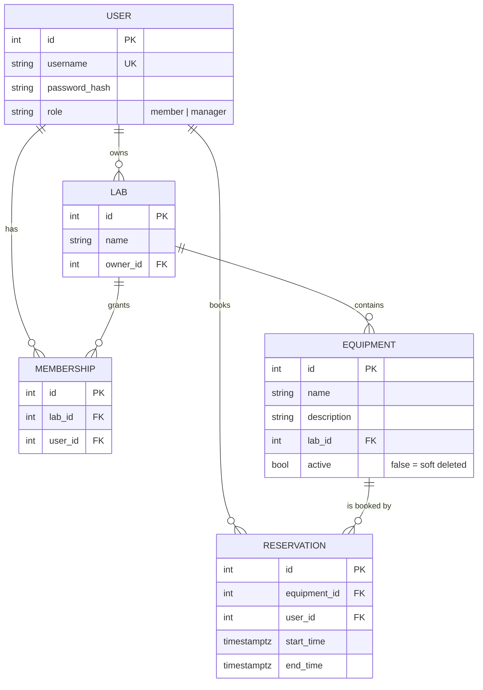

# BenchTime — Initial Architecture

Milestone 0 · 2026-09-02. Revised for Milestone 1 alongside the wireframes and the ADR.

## System context

BenchTime has no external datasets, APIs, or hardware dependencies. University SSO is post-MVP
(US-13) and depends on access we do not have yet.



## Containers

Three-tier client–server. Only the backend touches the database, every permission check happens
on the server, and the overlap rule is enforced by the database rather than by application code.



## Data model



A lab is an equipment calendar owned by exactly one manager, and a membership is what grants a
member access to it. Equipment removal is a soft delete so old reservations stay intact for the
usage statistics planned after the MVP.

## The overlap guarantee

Checking in application code is not enough — two requests can both read "the slot is free"
before either one writes. Postgres expresses the rule directly:

```sql
CREATE EXTENSION IF NOT EXISTS btree_gist;

ALTER TABLE reservation ADD CONSTRAINT no_overlapping_reservations
  EXCLUDE USING gist (
    equipment_id WITH =,
    tstzrange(start_time, end_time) WITH &&
  );
```

The API still validates and returns a readable error (NFR-6), but the constraint is what makes
the guarantee hold under concurrency. This backs US-4 in the [backlog](../BACKLOG.md).
