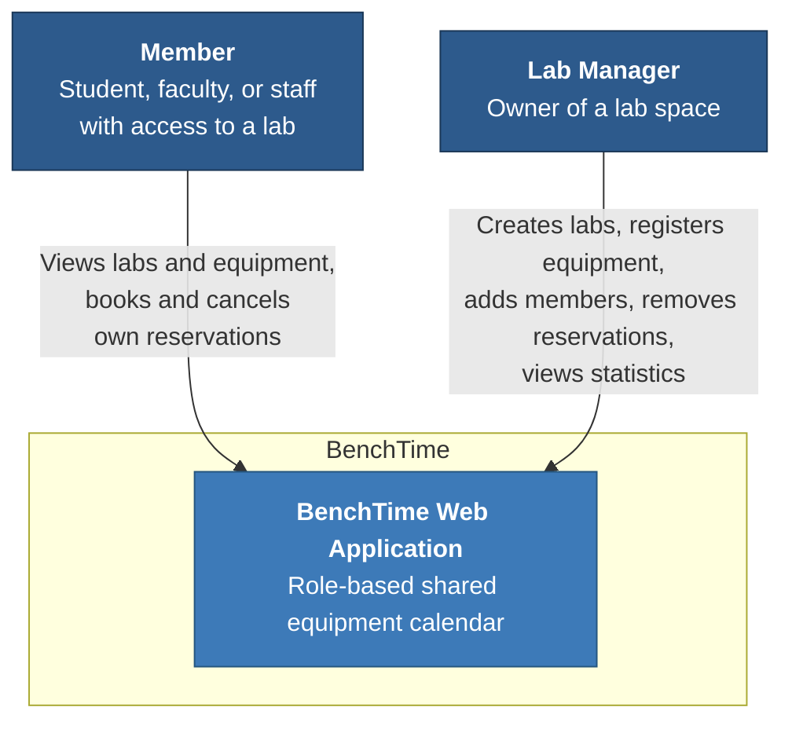
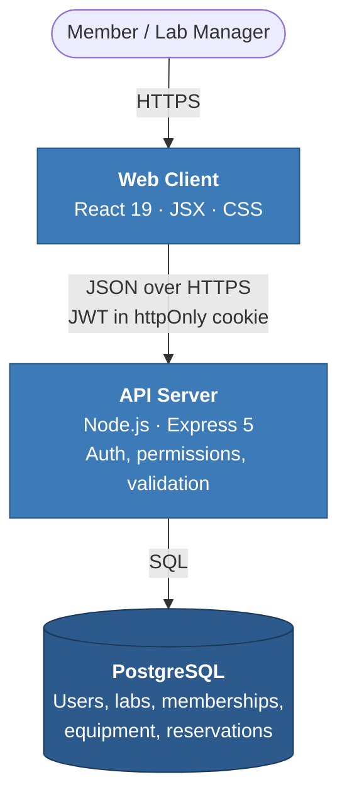
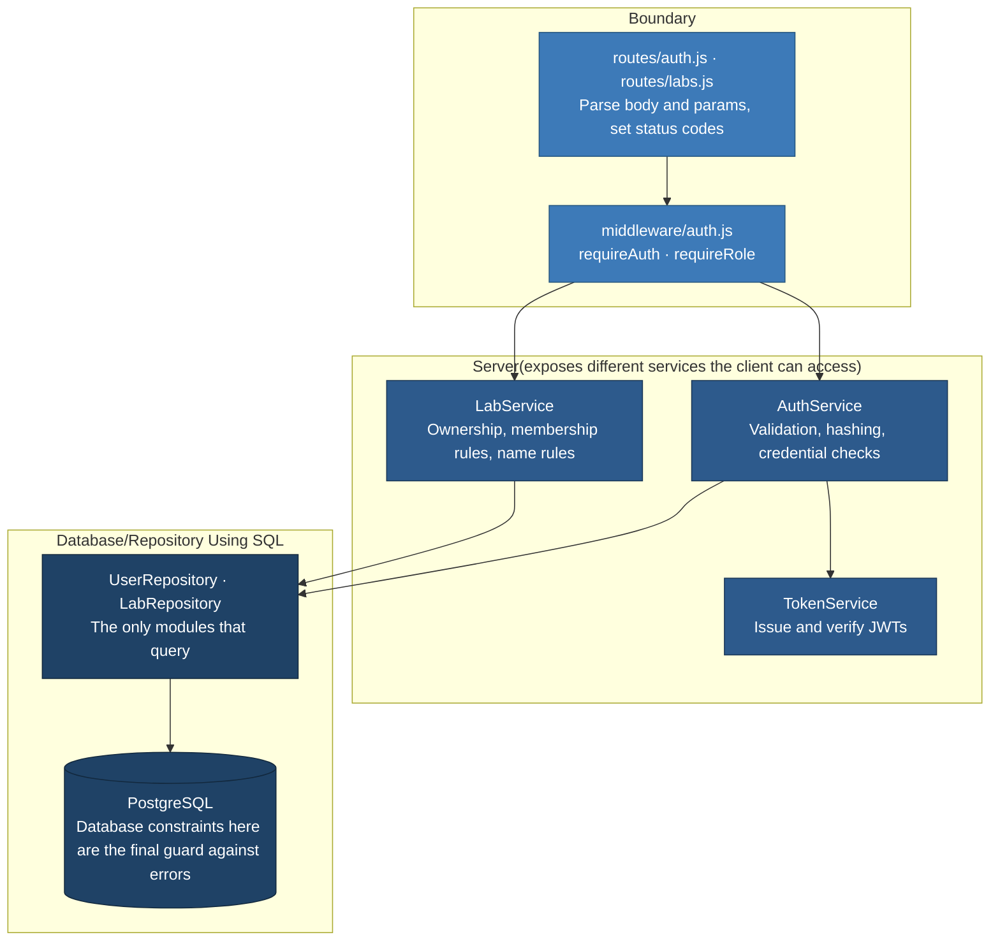
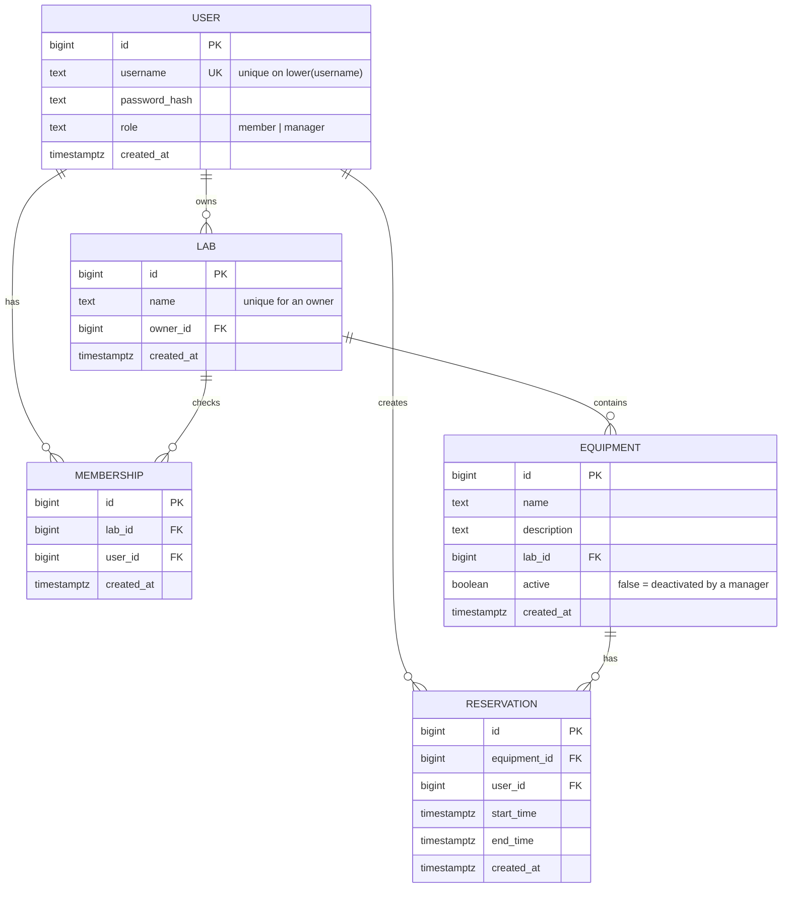

# BenchTime — Initial Architecture

Milestone 1 · 2026-09-29. Revised for Milestone 1 alongside the wireframes and the ADR.

## System context

BenchTime has no external datasets, APIs, or hardware dependencies. 

```mermaid
graph TB
    member["<b>Member</b><br/>Student, faculty, or staff<br/>with access to a lab"]
    manager["<b>Lab Manager</b><br/>Owner of a lab space"]

    subgraph boundary["BenchTime"]
        app["<b>BenchTime Web Application</b><br/>Role-based shared equipment calendar"]
    end

    member -->|"Views labs and equipment,<br/>books and cancels<br/>own reservations"| app
    manager -->|"Creates labs, registers equipment,<br/>adds members, removes reservations,<br/>views statistics"| app

    classDef person fill:#2d5a8c,stroke:#1a3757,color:#fff
    classDef system fill:#3d7ab8,stroke:#25567f,color:#fff
    class member,manager person
    class app system
```

## Architecture Overview

Three-tier client–server. Only the backend touches the database, every permission check happens
on the server. 

```mermaid
graph TB
    user(["Member / Lab Manager"])

    spa["<b>Web Client</b><br/>React 19 · JSX · CSS"]
    api["<b>API Server</b><br/>Node.js · Express 5<br/>Auth, permissions, validation"]
    db[("<b>PostgreSQL</b><br/>Users, labs, memberships,<br/>equipment, reservations")]

    user -->|HTTPS| spa
    spa -->|"JSON over HTTPS<br/>JWT in httpOnly cookie"| api
    api -->|SQL| db

    classDef c fill:#3d7ab8,stroke:#25567f,color:#fff
    classDef d fill:#2d5a8c,stroke:#1a3757,color:#fff
    class spa,api c
    class db d
```

## Layer responsibilities/API(Behavhior)

Each request crosses three layers with a some strict rules: **routes should never contain business rules and
repositories should never contain permission checks.** This is to prevent overlapping resposibilities.

```mermaid
graph TB
    subgraph boundary["Boundary"]
        routes["routes/auth.js · routes/labs.js<br/>Parse body and params, set status codes"]
        mw["middleware/auth.js<br/>requireAuth · requireRole"]
    end

    subgraph control["Server(exposes different services the client can access)"]
        authsvc["AuthService<br/>Validation, hashing, credential checks"]
        labsvc["LabService<br/>Ownership, membership rules, name rules"]
        toksvc["TokenService<br/>Issue and verify JWTs"]
    end

    subgraph entity["Database/Repository Using SQL"]
        repos["UserRepository · LabRepository<br/>The only modules that query"]
        db[("PostgreSQL<br/>Database constraints here are the final guard against errors")]
    end

    routes --> mw
    mw --> authsvc
    mw --> labsvc
    authsvc --> toksvc
    authsvc --> repos
    labsvc --> repos
    repos --> db

    classDef b fill:#3d7ab8,stroke:#25567f,color:#fff
    classDef c fill:#2d5a8c,stroke:#1a3757,color:#fff
    classDef e fill:#1f4266,stroke:#12283d,color:#fff
    class routes,mw b
    class authsvc,labsvc,toksvc c
    class repos,db e
```

Two checks always happen in this order for anything inside a lab to change: first the user must be authenticated(done with JWT) then the lab must verify what permissions they have access to(differs depending on if they are a manager or a member). `findOwnedLabOrThrow` runs before any member operation, which is why a manager cannot add members to somebody else's lab even though they hold the `manager` role. 

## Data model/flow

```mermaid
erDiagram
    USER ||--o{ LAB : "owns"
    USER ||--o{ MEMBERSHIP : "has"
    USER ||--o{ RESERVATION : "creates"
    LAB  ||--o{ MEMBERSHIP : "checks"
    LAB  ||--o{ EQUIPMENT : "contains"
    EQUIPMENT ||--o{ RESERVATION : "has"

    USER {
        bigint id PK
        text username UK "unique on lower(username)"
        text password_hash
        text role "member | manager"
        timestamptz created_at
    }
    LAB {
        bigint id PK
        text name "unique for an owner"
        bigint owner_id FK
        timestamptz created_at
    }
    MEMBERSHIP {
        bigint id PK
        bigint lab_id FK
        bigint user_id FK
        timestamptz created_at
    }
    EQUIPMENT {
        bigint id PK
        text name
        text description
        bigint lab_id FK
        boolean active "false = deactivated by a manager"
        timestamptz created_at
    }
    RESERVATION {
        bigint id PK
        bigint equipment_id FK
        bigint user_id FK
        timestamptz start_time
        timestamptz end_time
        timestamptz created_at
    }
```